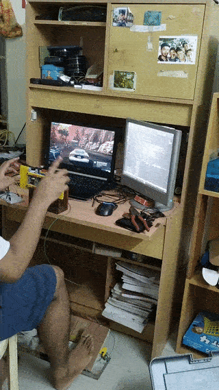

# Ultra Cheap Racing Sim
This super basic simulator uses an arduino UNO to sample inputs from accelerator and brake pedals driven by potentiometers and a rotary encoder for steering. 
The data is outputted serially and is read by a python script. The script taps into the Vjoy ( virtual joystick ) python api to simulate gamepad input calls.
  
The vjoy interface DLL must be in the same folder as the script and Vjoy must be installed.
This can be further hooked into x360 to emulate Xinput. The polling rate can be specified in x360ce and the sampling rate in the .ino code.  
This project will cost less than INR 500 or about $7 if you already have an Arduino UNO. Add a bit more if you don't.
  
  

# Installation requisites
Vjoy - http://vjoystick.sourceforge.net/site/index.php/download-a-install/download  
Pyvjoy ( python library for vjoy ) - https://pypi.org/project/pyvjoy/  
X360CE (just in case your game doesn't like vjoy ) - https://www.x360ce.com/  

# Hardware
The hardware requirement will greatly vary depending on how you want to make it but here is what I used: 
1) Two 5k potentiometers for foot pedals 
2) 2cm diameter springs for pedals 
3) Arduino UNO for reading inputs ( make sure to use a microcontroller with few analog inputs and atleast interrupt functionality on 2 pins) 
4) KY-040 rotary encoder 
5) LEGO for supplementary stuctures 
6) Wood from a 2000 year old oak tree :)  

# Results
 

**Working video**
  The video is at **media/video.mp4** . The gif given below is because I cannot attach video in this readme. The input lag is due to the game and my laptop being kinda slow, but the system in itself works all right. 
  

**Steering column is connected to encoder with hot glue** 
 

**Foot Pedals View** 
 

**Potentiometer driving mechanism** 
 
