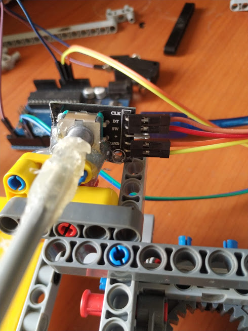

# Diy-racing-sim
Basic diy racing sim  

This simulator uses an arduino UNO to sample inputs from accelerator and brake pedals driven by potentiometers and a rotary encoder for steering. 
The data is outputted serial and is read by a python script. The script taps into the Vjoy ( virtual joystick ) python api to simulate gamepad input calls.
  
The vjoy interface DLL must be in the same folder as the script and Vjoy must be installed.
This can be further hooked into x360 to emulate Xinput. The polling rate can be specified in x360ce and the sampling rate in the .ino code. 
  

I'll put in some pictures to give a rough build idea

# Steering column is connected to encoder with hot glue

# Steering column is connected to encoder with hot glue

